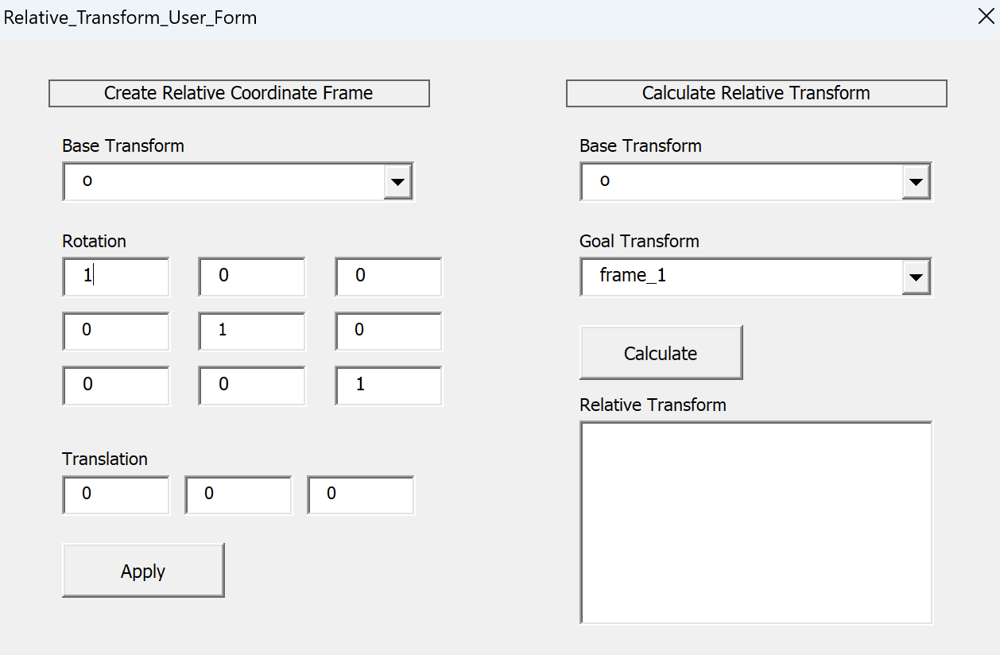
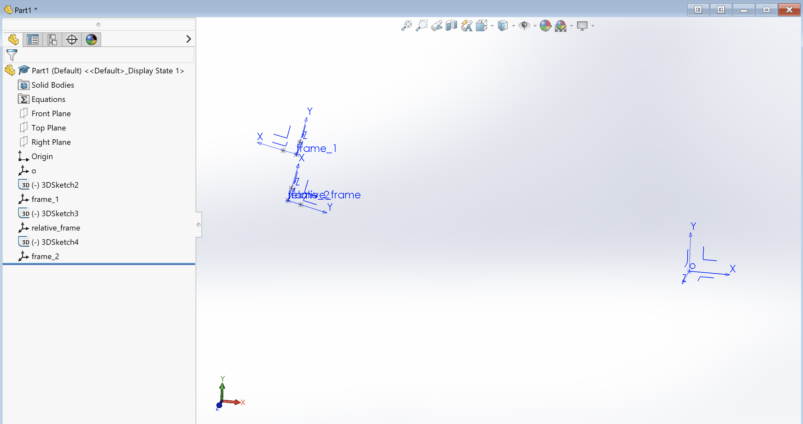

# Solidworks relative transform macro
Solidworks macro for **Part files** to create coordinate frames from 4x4 transforms and calculate relative transforms between coordinate frames. (not sure why it doesn't work for assemblies...tbd)

In the macro, there are two features: Create Relative Coordinate Frame and Calculate Relative Transform. 

## Create Relative Coordinate Frame
From the drop-down menu, you can select an existing coordinate frame from your feature tree. The order for the rotation matrix is the standard, normalized 3x3 matrix (column 1 is the x-axis, etc), and the order for translation is *x, y, z* (units in meters). 

When you click *Apply*, the macro will create a new coordinate frame in your Part file with the 3D sketch used to instantiate it. 

## Calculate Relative Transform
From the drop-down menu, you can select two existing coordinate frames from the feature tree to calculate the relative transform from the *Base Transform* to the *Goal Transform*. The relative transform will populate in the textbox below, following the standard homogeneous 4x4 matrix format:

$$
T =
\left[
\begin{array}{cccc}
R_{11} & R_{12} & R_{13} & T_1 \\
R_{21} & R_{22} & R_{23} & T_2 \\
R_{31} & R_{32} & R_{33} & T_3 \\
0 & 0 & 0 & 1
\end{array}
\right]
$$

## How to install
Please refer to the Solidworks documentation for assigning this Macro to a Toolbar button: https://help.solidworks.com/2026/english/SolidWorks/sldworks/t_assigning_macro_toolbar_button.htm?id=1.13.7.6.0

## Example
Testing with data from trakSTAR ascension system. Two sensors, labeled *frame_1* and *frame_2*, were used to record their 4x4 matrix position. A third matrix, calculated as the relative transform from *frame_1* to *frame_2*, was defined as *relative_frame*. As expected, when *relative_frame* was applied to *frame_1*, it aligns perfectly with *frame_2*. 

Note: the origin frame *o* was manually made as a separate coordinate frame, not the native *Origin* in the Part file. 

Data used in example: 

$$
\text{frame 1} =
\left[
\begin{array}{cccc}
-0.9746 &  0.2222 & -0.0270 & -0.2993 \\
 0.2223 &  0.9750 & -0.0024 &  0.0509 \\
 0.0258 & -0.0083 & -0.9996 & -0.0345 \\
 0.0000 &  0.0000 &  0.0000 &  1.0000
\end{array}
\right]
$$

$$
\text{frame 2} =
\left[
\begin{array}{cccc}
 0.2316 &  0.9728 & -0.0053 & -0.3044 \\
 0.9728 & -0.2317 & -0.0051 &  0.0146 \\
-0.0062 & -0.0040 & -1.0000 & -0.0346 \\
 0.0000 &  0.0000 &  0.0000 &  1.0000
\end{array}
\right]
$$

$$
\text{relative frame} =
\left[
\begin{array}{cccc}
-0.0097 & -0.9997 & -0.0218 & -0.0031 \\
 1.0000 & -0.0097 &  0.0022 & -0.0365 \\
-0.0024 & -0.0218 &  0.9998 &  0.0003 \\
 0.0000 &  0.0000 &  0.0000 &  1.0000
\end{array}
\right]
$$
